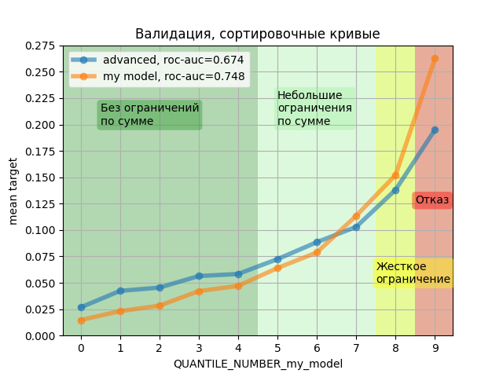
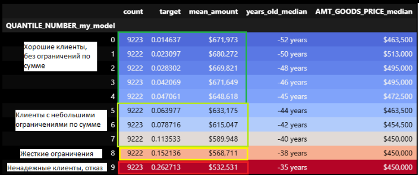
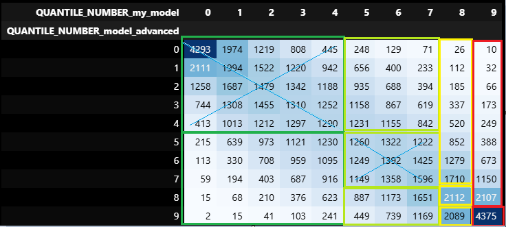
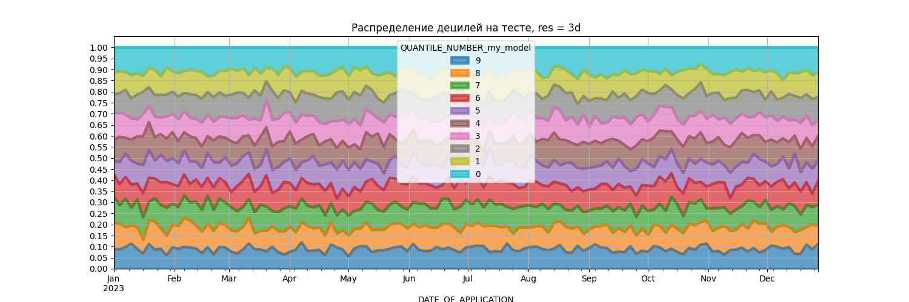

# Credit Scoring (SHIFT)

Проект на основе курса ШИФТ от ЦФТ. ML-пайплайн для оценки риска дефолта клиента: получение данных из БД, генерация признаков из данных бюро кредитных историй, обучение и сравнение моделей, оценка качества и мониторинг дрифта данных, сервис и тестирование сервиса.


## Содержание
- [О проекте](#о-проекте)
- [Стек технологий](#стек-технологий)
- [Результаты моделей](#результаты-моделей)
- [Анализ и визуализация](#анализ-и-визуализация)
- [Установка и запуск](#установка-и-запуск)
- [Пайплайн генерации признаков](#пайплайн-генерации-признаков)
- [Структура проекта](#структура-проекта)

## О проекте

Проект решает задачу бинарной классификации: предсказать вероятность дефолта заемщика (`target`: 1 - дефолт, 0 - не дефолт) по данным заявки и кредитной истории из бюро.

**Данные:** таблицы из БД + сгенерированные признаки `application_features`, `bureau_features`, `bureau_balance_features`.

**Предобработанный датасет:** 307511 строк, 193 признака. Доля дефолтов равна около **8%** (сильный дисбаланс классов). После feature engineering и отбора - 245 признаков, топ-50 по `feature_importances_` Random Forest используется для обучения моделей.

**Финальная модель:** логистическая регрессия (`C=0.1`, `penalty='l1'`, `solver='liblinear'`) выбрана из-за высокого recall (0.67) и интерпретируемости, несмотря на более высокий ROC-AUC у градиентного бустинга.

## Стек технологий

- **Язык:** Python 3.11
- **ML:** scikit-learn, CatBoost, scipy
- **Данные:** pandas, numpy
- **БД:** PostgreSQL
- **Пайплайн:** DVC
- **Визуализация:** matplotlib, plotly
- **Управление зависимостями:** Poetry

## Результаты моделей

Сравнение четырех моделей на тестовой выборке (52683 строки):

| Модель | Лучшие гиперпараметры | ROC-AUC | Recall (класс 1) | Precision (класс 1) | Время обучения |
|:------:|:---------------------:|:-------:|:----------------:|:-------------------:|:--------------:|
| **Логистическая регрессия** | `C=0.1, penalty='l1'` | **0.7318** | **0.67** | 0.15 | 270 с |
| Дерево решений | `max_depth=7, min_samples_leaf=2` | 0.7194 | 0.67 | 0.15 | 160 с |
| Случайный лес | `n_estimators=200, max_depth=10` | 0.7397 | 0.59 | 0.17 | 700 с |
| Градиентный бустинг | `lr=0.05, max_depth=7, n_estimators=200` | **0.7476** | 0.02 | 0.46 | 2150 с |

Несмотря на лучший ROC-AUC, градиентный бустинг показал **recall = 0.02**, т.е. находит только 2% дефолтных клиентов. Из-за дисбаланса классов модель предсказывает почти всех как "не дефолт".

В кредитном скоринге recall важнее precision: пропустить дефолт (False Negative) для банка гораздо дороже, чем ошибочно отказать хорошему клиенту (False Positive). Логистическая регрессия находит 67% дефолтов, что является лучшим результатом среди всех моделей при сопоставимом ROC-AUC.

## Анализ и визуализация

### Кривые сортировки и матрица переходов

| Кривые сортировки | Сравнение моделей | Матрица переходов |
|:-----------------:|:-----------------:|:-----------------:|
|  |  |  |

#### **Что показывают графики:**

- **Sorting curves (кривая сортировки).** По оси X - дециль клиента (0 - самые "хорошие", 9 - самые "плохие"), по оси Y - средний `target` (доля дефолтов) в дециле. Чем круче растет кривая, тем лучше модель разделяет клиентов по риску. Клиенты разбиты на 4 бизнес-группы: `(-inf, 4.5]` - без ограничений, `(4.5, 7.5]` - небольшие ограничения, `(7.5, 8.5]` - жесткое ограничение, `(8.5, inf]` - отказ. Видно, что `my_model` дает более крутой рост: в первом дециле доля дефолтов ниже, а в последнем - выше, чем у `model_advanced`. ROC-AUC: `my_model` = 0.7318, `model_advanced` = 0.7194.
- **Sort table model advanced.** Цветовая матрица: строки - децили `model_advanced`, столбцы - децили `my_model`, цвет - доля клиентов. Диагональ - клиенты, оставшиеся в том же дециле. Видно систематическое смещение вправо-вниз: клиенты из каждого дециля `model_advanced` в среднем переходят в более высокие децили `my_model`, то есть новая модель оценивает их как более рисковых. Это связано с тем, что `my_model` видит дополнительные сгенерированные признаки (`WEIGHTED_EXT_SCORE`, `INTEREST_RATE` и др.), которые делают оценку строже.
- **Матрица переходов по бизнес-категориям.** Матрица показывает, как клиенты переходят между группами. Зеленая зона `my_model` на 69.7% состоит из клиентов, которые и раньше были в зеленой зоне, ещё 28% - это клиенты из светло-зеленой зоны. То есть новая модель "поднимает" в зону без ограничений тех, кого старая считала средне-рисковыми.

### Анализ дрифта данных



График показывает распределение клиентов по децилям `my_model` на тестовой выборке во времени. Если бы модель была подвержена сильному дрифту, доли децилей со временем бы "плыли" - например, в последние недели резко росла бы доля клиентов из 9-го дециля.

Вывод: распределение близко к равномерному. Отклонения от 10%:

- дециль 0 (лучшие клиенты) — 11.0%;
- дециль 9 (худшие клиенты) — 8.9%.

Значимого дата-дрифта не обнаружено. Небольшое отклонение в крайних децилях (около 1%) допустимо.

Подробный анализ кривых сортировки, матрицы переходов и дрифта данных находится в ноутбуке [`src/metrics/model-validation.ipynb`](src/metrics/model-validation.ipynb).

## Установка и запуск

### 1. Клонирование репозитория

```bash
git clone https://github.com/AlexanderSh11/credit_scoring_shift.git
cd credit_scoring_shift
```

### 2. Установка Poetry

```bash
pipx install poetry
# или
pip install poetry
```

### 3. Установка зависимостей

```bash
poetry install
```

### 4. Настройка переменных окружения

Создайте файл `.env` в корне проекта (или задайте переменные в системе):

```
DB_HOST=localhost
DB_PORT=5432
DB_NAME=credit_scoring
DB_USER=your_user
DB_PASSWORD=your_password
```

### 5. Запуск пайплайна генерации признаков (DVC)

```bash
cd pipeline
dvc repro
```

Это последовательно выполнит три стадии:

1. `generate_application_features` создаст файл `application_features.csv`
2. `generate_bureau_features` создаст файл `bureau_features.csv`
3. `generate_bureau_balance_features` создаст файл `bureau_balance_features.csv`

### 6. Обучение моделей

Обученные модели сохраняются в `hw6/models/` в формате `.pkl`. Для воспроизведения результатов достаточно запустить:

```bash
python hw6/machine_learning.py
```

Глобальные переменные для настройки находятся в начале `hw6/machine_learning.py`:

| Переменная | Значение | Описание |
|:-----------|:---------|:---------|
| `TEST_SIZE` | `0.2` | Доля тестовой выборки |
| `TOP_N_FEATURES` | `50` | Количество отбираемых признаков Random Forest |
| `MIN_FREQUENCY_IN_CAT_FEATURE` | `5` | Минимальная частота категории для OneHotEncoder |
| `MODELS_DIR` | `hw6/models` | Папка для сохранения моделей |

> Для быстрого запуска можно вставить в `param_grid` класса `ModelTrainer` только лучшие гиперпараметры (они указаны в таблице выше). Полный GridSearch занимает до 35 минут из-за градиентного бустинга.

## Пайплайн генерации признаков

DVC-пайплайн (`pipeline/dvc.yaml`) описывает три независимых этапа:

| Этап | Скрипт | Вход | Выход |
|:-------|:-------|:-----|:------|
| `generate_application_features` | `src/app/modelling/features/application_features.py` | `application` из БД | `application_features.csv` |
| `generate_bureau_features` | `src/app/modelling/features/bureau_features.py` | `bureau` из БД | `bureau_features.csv` |
| `generate_bureau_balance_features` | `src/app/modelling/features/bureau_balance_features.py` | `bureau_balance` из БД | `bureau_balance_features.csv` |

Все три этапа зависят от `src/app/utils/db_manager.py`.

### Предобработка данных

- Удаление ID клиента (`sk_id_curr`, `id_change_delay`), константных признаков
- Заполнение пропусков
- Генерация новых признаков
- Кодирование: бинарные с помощью `LabelEncoder`, многоклассовые - `OneHotEncoder` (если слишком много категорий, то топ-10 частых + 'other')
- Отбор признаков проводился с помощью Random Forest, топ-50 по `feature_importances_`

## Структура проекта

```
credit_scoring_shift/
├── src/
│   ├── app/
│   │   ├── antifraud/              # антифрод-модуль
│   │   ├── core/                   # ядро скоринга
│   │   │   ├── api.py              # API
│   │   │   ├── calculator.py       # расчет суммы займа с помощью обученной модели
│   │   │   └── model.py            # обертка над моделью
│   │   ├── modelling/
│   │   │   └── features/           # генерация признаков
│   │   │       ├── application_features.py
│   │   │       ├── bureau_features.py
│   │   │       └── bureau_balance_features.py
│   │   ├── scoring/                # скоринговая логика
│   │   └── utils/
│   │       ├── csv_analyser.py     # анализ CSV-файлов
│   │       ├── db_manager.py       # работа с БД
│   │       └── log_parsing.py      # парсинг логов
│   ├── config/
│   │   └── config.py               # конфигурация
│   ├── metrics/                    # метрики и анализ
│   │   ├── model-validation.ipynb
│   │   └── *.png                   # графики
│   └── tests/                      # тесты
├── hw6/                            # ML-пайплайн
│   ├── data_loading.py
│   ├── data_preprocessing.py
│   ├── feature_engineering.py
│   ├── feature_selector.py
│   ├── machine_learning.py         # точка входа для обучения
│   ├── model_trainer.py            # класс ModelTrainer
│   └── models/                     # обученные модели (.pkl)
├── notebooks/
│   ├── core_tests.ipynb
│   └── hw3_2.ipynb
├── pipeline/
│   ├── dvc.yaml                    # DVC-пайплайн
│   └── dvc.lock
├── pyproject.toml                  # зависимости (Poetry)
├── poetry.lock
├── setup.cfg
├── README.md
```
